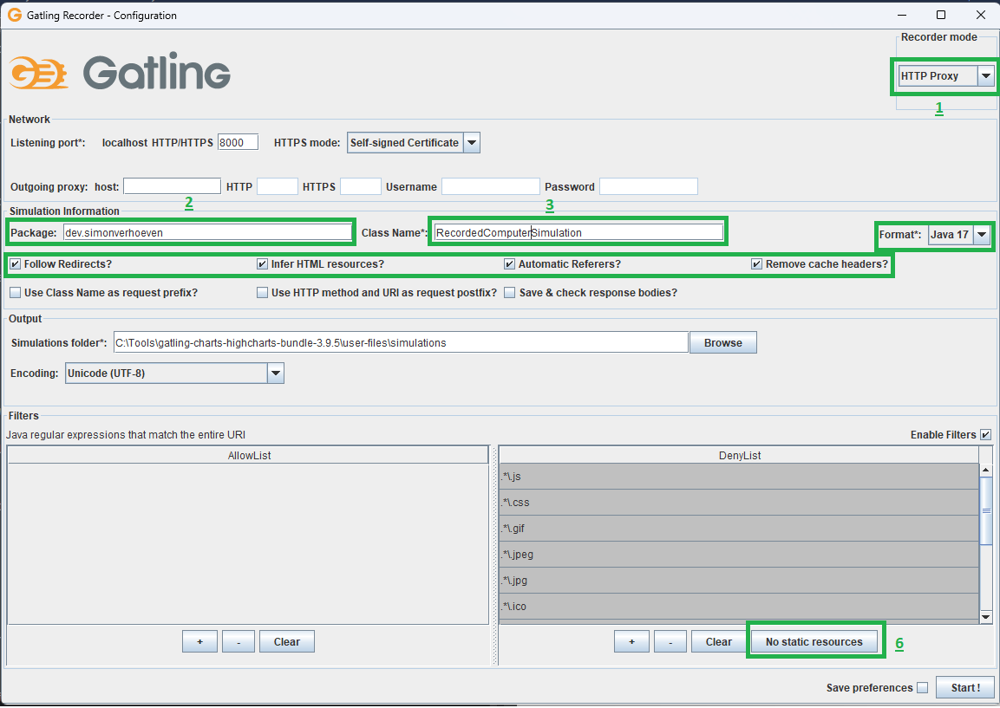
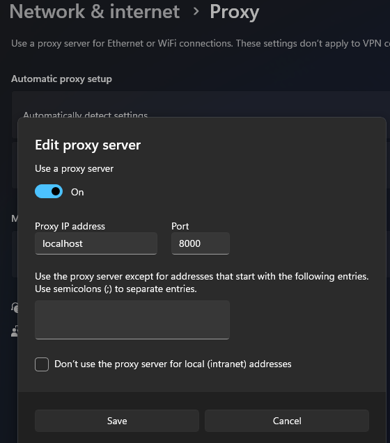
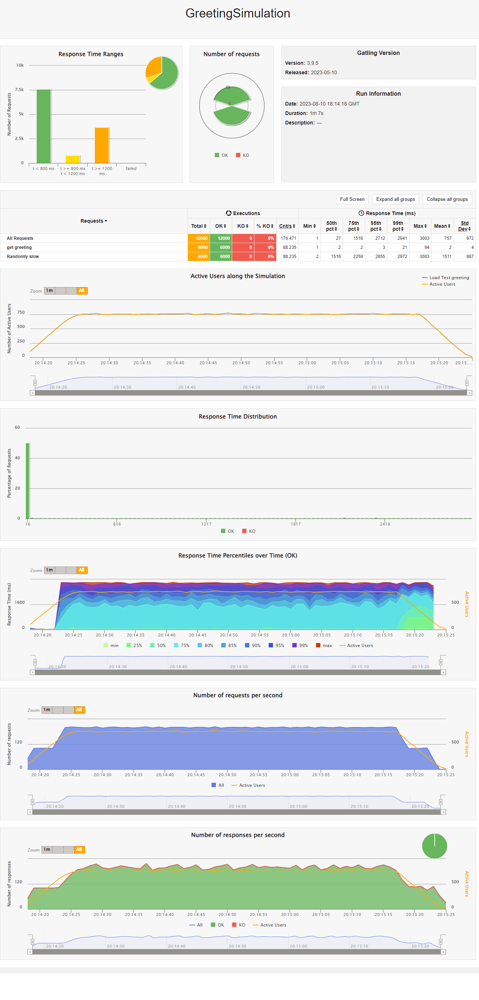

= Gatling - demo
:toc:
:toc-placement:
:toclevels: 3

== Load testing?

Load testing entails testing how our application performs under a significant load so we can be certain it behaves as expected when there's an influx of users.
Or at least so we know what it can cope it, and at what point we might potentially need to take action.

After all, it might not (only) be the code that's the issue.

This is a process that requires quite a bit of cooperation between testers, developers, and those using it to properly determine the scenarios, and a smooth & swift feedback loop is important to make sure our solutions work properly. And it will likely be some of the most expensive tests given both the people involved and the need for a testing environment that's representative of the production configuration.

== What is Gatling?

It is a performance load-testing tool that easily allows us to simulate traffic, and perform load testing as code, so we can integrate it with CI/CD and automation.

We can make use of the https://gatling.io/docs/gatling/tutorials/quickstart/#using-the-recorder[Recorder] to record a scenario or write our own using the Java/Scala DSL.

== Introduction

Gatling has a couple of core concepts we should know:

* Virtual user: a dummy user implemented by Gatling as a message
* Session: each virtual user has a Session that acts as a placeholder that can be used to inject, or capture & store data.
* Scenario: the steps our virtual user has to perform
* Simulation: the definition of the test such as the number of users, HTTP protocol, acceptance criteria, hooks, and throughput sharing, ...
* Recorder: the UI we can use to record a Scenario and output a Simulation
* Feeders: the API we use to inject data from external sources into the virtual user's session
* Checks: a response processor so that we can verify certain conditions, and optionally capture some information to store in the Session for later reuse
* Assertions: used to define acceptance criteria

Also, keep in mind that in Gatling the default unit for Duration parameters is 1 second.

== Basic setup

Basic tests can consist of these three components

=== 1) The protocol

[code,java]
----
final HttpProtocolBuilder httpProtocol = http
    .baseUrl("http://localhost:8080")
    .acceptHeader("application/json")
    .userAgentHeader("Gatling performance Test");
----

This is the base configuration we'll be using for our API. +
_note: Gatling also supports JMS & MQTT_

=== 2) The scenario

[code,java]
----
ScenarioBuilder scenario = CoreDsl.scenario("Load Test greeting")
    .exec(http("get greeting")
            .get(session -> "/greet/" + UUID.randomUUID())
            .check(status().is(200))
    )
    .pause(5)
    .exec(http("Randomly slow")
            .get("/slow")
            .check(status().is(200))
    );
----

The scenario that we'll be executing. +
In this case, we're invoking the greeting call, verifying that it's returning OK, waiting 5 seconds, invoking another endpoint, and checking the status of that one.
*note*: We are also giving out chain a label to make it easily identifiable in the output.

=== 3) The simulation

[code,java]
----
public GreetingSimulation() {
    this.setUp(scenario.injectOpen(constantUsersPerSec(100).during(Duration.ofSeconds(60))))
            .protocols(httpProtocol);
}
----

The simulation ties it all together. We set up our performance test for our given scenario, and define the amount of users and the duration of the test using the given protocol.

== Using the recorder

Once you've downloaded the recorder https://gatling.io/open-source/[from the website] you can start the Gatling recorder using the `recorder.sh` or `recorder.bat` within `$GATLING_HOME/bin/`

For this example, we'll be making use of the https://computer-database.gatling.io/computers[Gatling sample application]

We start by configuring the recorder

And we configure the following settings

. proxy => HTTP proxy
. package => our desired package name
. class name => the simulation name
. format => Java 17
. settings => we follow redirects, infer HTML resources, enable automatic references, and remove cache headers
. deny list => we click no static resources

Then we need to configure our proxy so that we can record the scenario:

After this, we can `start` our recording

For example, let us:

* navigate to the site
* look up on `ACE`
* select the first result
* mark it as belonging to the first company
* save
* opt to create a new computer
* name it Sampler and save

And then hit `Save` in the recorder

And we'd end up with a recording akin to this link:raw/RecordedComputerSimulation.java[Sample recording].

=== Running the recording

==== Using the commandline tool

We can run the recording by using `gatling.sh` or `gatling.bat` within `$GATLING_HOME/bin/`

We'll be prompted for:

* whether to run locally/gatling cloud/package => we'll run it locally
* an optional description

After the run, it will show us where we can find the simulation results

=== Using a build tool

==== General configuration

We can set up a `gatling.conf` file in `src\test\resources` to define global parameters such as the used encoding, SSL setup, shutdownTimeout, ... +
To view a list of possible parameters, and their defaults you can visit https://github.com/gatling/gatling/blob/main/gatling-core/src/main/resources/gatling-defaults.conf[their github repository].

===== Maven project

We need to add:

[code,xml]
----
<dependencies>
  <dependency>
    <groupId>io.gatling.highcharts</groupId>
    <artifactId>gatling-charts-highcharts</artifactId>
    <version>3.9.5</version>
    <scope>test</scope>
  </dependency>
</dependencies>

<plugin>
  <groupId>io.gatling</groupId>
  <artifactId>gatling-maven-plugin</artifactId>
  <version>4.4.0</version>
</plugin>
----

*note:* If your scenario was written/recorded as Scala you will need to use the `scala-maven-plugin`!

==== Gradle project

There are a couple of things we need to keep in mind:

* we'll need to be using at least Gradle 5
* in case of a multi-project build we should only add it to those containing Gatling simulations
* our simulations are expected to be located in: `src/gatling/{java|kotlin|scala}`

We'll need to add the following to our build file:

[code,groovy]
----
 plugins {
   id 'io.gatling.gradle' version "MANUALLY_REPLACE_WITH_LATEST_VERSION"
 }
----

==== Execution

We can use then put the recording in the expected location, and execute `mvn gatling:test` or `gradle gatlingRun` to perform our simulation. +
*note*: if you have multiple simulations you will either need to enable `runMultipleSimulations` in your configuration|commandline or specify the `simulationClass` in your configuration|commandline.

During the execution, Gatling will output the progress of the current Simulation to the console, and at the end of each Simulation a summary of it.

After the execution, we will find our report in `target` or `build` respectively. +
And we might end up with a report like this:

This shows us:

* response time distributed in ranges
* summary of our requests
* active users over time
* response time distribution
* response time percentiles over time
* requests per second over time
* responses per second over time
* response time against global RPS when consulting a specific group

*note*: a lot of the ranges/percentiles can be configured in `gatling.conf`

== Diving a bit deeper

This all was quite a basic setup, now of course when we want to do this kind of testing we generally want to configure a lot more.
If you want to follow along, please check out/download this repository and make sure you have Java and Maven installed.

=== Splitting up our scenario

Now we have one big Simulation, now ideally we'd like to split this up so that we can reuse parts and make it more maintainable in case the application under test changes.

We can achieve this by making use of `ChainBuilder`. Each portion would be a chain in our Scenario link.

So we can go from:

[code,java]
----
ScenarioBuilder sampleScenario = scenario("Load Test greeting")
    .exec(http("get greeting")
            .get(session -> "/greet/" + UUID.randomUUID())
            .check(status().is(200))
    )
    .pause(5)
    .exec(http("Randomly slow")
            .get("/slow")
            .check(status().is(200))
    );
----

to

[code,java]
----
ChainBuilder greeting = exec(http("get greeting")
        .get(session -> "/greet/" + UUID.randomUUID())
        .check(status().is(200))
)
        .pause(5);

ChainBuilder slowcall = exec(http("Randomly slow")
        .get("/slow")
        .check(status().is(200))
);

ScenarioBuilder sampleScenario2 = scenario("Load test greeting").exec(greeting, slowcall);
----

=== Configuring the protocol

The beforehand shown protocol configuration is quite basic, but a lot more can be done with it.

* customizing the URL used to warm up the Java/NIO engine (or disable this warm-up) using `warmUp(url)` and `disableWarmup()` respectively
* configure the maximum number of connections per host `maxConnectionsPerHost(N)`
* switch the behaviour from client => browser to behave more like server => server by using `shareConnections()`
* configure hostname aliasing `hostNameAliases(...)`
* configure the virtual host `virtualHost(N)`
* disable caching `disableCaching()`
* ...

For example:
[code,java]
----
private HttpProtocolBuilder httpProtocol = http
    .baseUrl("https://computer-database.gatling.io")
    .acceptEncodingHeader("gzip, deflate, br")
    .acceptLanguageHeader("en-GB,en;q=0.9,nl;q=0.8")
    .disableCaching()
    .upgradeInsecureRequestsHeader("1");
----

For a full list, you can check:

* https://gatling.io/docs/gatling/reference/current/http/protocol/[HTTP protocol documentation]
* https://gatling.io/docs/gatling/reference/current/jms/#protocol[JMS protocol documentation]
* https://gatling.io/docs/gatling/reference/current/mqtt/#mqtt-protocol[MQTT protocol documentation]

=== User management

Now in the sample recording we've made there's 1 user. That's nice to run through the flow, but that will (hopefully) not expose any performance issues in your project.

Gatling supports 2 different workload models for users:

* closed: we control the *concurrent* number of users
* open: we control the *arrival rate* of users

this API allows us to define things such as:

* ramp-up period
* stress peak
* constant number of users per second during a certain time
* ...

For example, we could have this setup:
[code,java]
----
sampleScenario.injectOpen(
    nothingFor(20), // nothing for 20 seconds
    atOnceUsers(100), // 100 users at once, once the click hits 9:00
    rampUsers(50).during(60) // evenly add 50 users over 60 seconds as they sip their coffee
)
----

This allows us to mimic behaviours like call centers/morning rush/...

A full list of details can be found on the https://gatling.io/docs/gatling/reference/current/core/injection/[injection] page.

*request*: If you're using Gatling's sample application, please keep in mind to not set your values to high as not to overload it.

=== Data setup

For some realistic tests we of course want to set up some data, rather than the static data from the recorder.
We will inject this data into our virtual users, and later retrieve it.

==== Setting data

We have three options:

1) by extracting it from responses, and saving it such as:

[code,java]
----
.check(status().is(200).saveAs("Status"))
----

2) using the `Session` API
[code,java]
----
ChainBuilder sessionStep = exec(session -> {
    return session.set("someField", "value");
});
----
*note*: keep in mind `Session` instances are immutable!

3) Using feeders

A feeder is an alias for `Iterator<Map<String, T>>` so the created component will poll `Map<String, T>` to inject into the context.

Gatling offers us quite a lot of feeders such as:

* CSV
* JSON
* JDBC
* Redis
* ...

With multiple `Strategies` (`queue`, | `random` | `shuffle` | `circular`) on how to treat these.

A full summary can be found on the https://gatling.io/docs/gatling/reference/current/core/session/feeder/[feeder] page.

But a basic one can be as easy as:
[code, java]
----
Iterator<Map<String, Object>> feeder = Stream.generate((Supplier<Map<String, Object>>) () -> Collections.singletonMap("dieRoll", ThreadLocalRandom.current().nextInt(1, 7))).iterator();
----

We can then `feed(feeder)` which we call at the same place as `exec`. +
Now each time a `Virtual User` reaches this step a value will be fetched from the `Feeder` and injected into the `Session`.

==== Using data

We can either programmatically get it with the Session API `session.get("dieRoll")` or using the Expression Language `"${dieRoll}"`

*note*: the EL also has a lot of built-in functions, see for reference the https://gatling.io/docs/gatling/reference/current/core/session/el/[expression language] page

=== User information

Besides the data we manage ourselves, Gatling also provides us with some useful information:

* unique id of the virtual user: `session.userId()`
* scenario the virtual user executes: `session.scenario()`
* group(s) the virtual user is in: `session.groups()`

=== Session state management

Now generally one is also interested in the state of the `Session`, and in some cases altering it.

We can determine whether it has failed using: `session.isFailed()`.

Now in case we're making use of interrupt mechanisms offered by Gatling such as `exitHereIf(...)` or `exitHereIfFailed(...)` it might be useful to alter the state so they (do not) trigger.

This can be achieved using `session.markAsSucceeded()` or `session.markAsFailed()`.

== Validation

Besides just gathering insights into the performance we might also want to do some validation.
Within Gatling these are grouped within `Assertions` and `Checks`

=== Assertions

These are used to validate certain metrics and are defined on a given scope, for a certain static and are applied to your Simulation`

Gatling has 3 scopes:

* global: uses statistics calculated from all requests
* forAll: statistics calculated for each individual request
* details(path): statistics calculated from a group/request, defined like a Unix path

For these 5 statistics:

* response time
* allRequests: number of requests
* failedRequests
* successfulRequests
* requestsPerSec

for which we can define certain conditions for a given metric.

For example, if we want to check that less than 1% of each request fails we can do:

[code,java]
----
this.setUp(sampleScenario.injectOpen(constantUsersPerSec(100).during(Duration.ofSeconds(60))))
    .assertions(forAll().failedRequests().percent().lte(1D))
----

A full list of possible assertions can be found on the https://gatling.io/docs/gatling/reference/current/core/assertions/[Assertions] page.

=== Checks

Checks are used to validate our requests, and as we've seen before to extract data and contribute it to the Virtual User's session for later reuse.

We can use `check(status().is(200))`, or in a conditional manner using `checkIf(SOME_CONDITION).then(status().is(200))`

The API provides us a DSL to:

* define the *check type* (response type, body length, body bytes, ...)
* *extract* data, if not explicitly defined Gatling will perform an implicit `find`
* optionally *transform* the data (default if blank, append a (session) value, ...)
* *validate* the check (is X, isNull, in, ...), if none is defined Gatling checks for `exists` by default
** you can always use `.validate(...)` to provide your own validation logic
* optionally *name* the check, to make it clearer in case the check fails
* optionally *save* the result of the check on the Virtual User's `Session` for later reuse

Let's say we want to verify we're actually starting our greeting with `Hello`, but want to be a tad louder about it and store it on our Virtual User's `Session` for later reuse. +
Then we could do something akin to:

[code,java]
----
.check(
    bodyString()
        .transform(String::toUpperCase)
        .validate("Contains HELLO validation", (value, session) -> {
            if (value.startsWith("HELLO")) {
                return value;
            } else {
                throw new IllegalStateException("Value " + value + " should start with HELLO");
            }
        })
        .name("Greeting message check")
        .saveAs("loudMessage")
)
----

Here we're:

. checking our body text
. transforming it to be in uppercase
. adding validation on it with the recognizable name `Contains HELLO validation`
. explicitly giving the check a clear name
. saving it on our `Session` as `LoudMessage`

Then in subsequent checks, we can use this value:
[code,java]
----
.checkIf(session -> session.getString("loudMessage") != null).then(status().not(404))
----

To learn more about Checks you can visit the https://gatling.io/docs/gatling/reference/current/core/check/[documentation].

== Scaling

Now we might want to test quite a big load, and our device might not quite be able to cope with this.

Gatling Enterprise offers a clustering mode, which allows us to deploy injectors on different instances and perform live aggregation on the results.

We can also achieve something akin using the free version with the following steps:

* deploy our `Simulation` and its dependencies on multiple instances
* trigger these all with the `-nr` (no reports flag) since we don't need individual reports
* place all the generated logfiles in the results folder of one of the instances
* generate the reports using `-ro {reportFolderName}` (ro = reports only flag)

== Realtime monitoring

By default, only Gatling provides live feedback in the console but there in case you're interested in a more visually appealing way you can use:

. https://gatling.io/enterprise/[Gatling enterprise] which offers realtime monitoring
. Graphite integration over the Graphite `plaintext` protocol, by adding `graphite` to the data writers, and specifying the host:

[code,json]
----
gatling {
  data {
    writers = [console, file, graphite]

    graphite {
      host = "localhost"
      port = 8086
    }
  }
}
----

== Notes
* Gatling as a standalone bundle can be used for Scala and Java, for Kotlin you'll need a `Maven` or `Gradle` project.
* Gatling requires Java 8 or higher
* there are other interesting tools such as Element, Selenium, and Apache JMeter

== References
* https://gatling.io/[The official website]
* https://gatling.io/docs/gatling/reference/current/extensions/[Extensions]
* https://gatling.io/docs/gatling/reference/current/core/configuration/[Configuration options]
* https://gatling.io/docs/gatling/reference/current/core/operations/[Operating system tuning]
* https://gatling.io/enterprise/[Gatling enterprise offering] - both self-hosted and as cloud
* https://computer-database.gatling.io/computers[Gatling sample application] - this application is provided by Gatling to be targeted by the recorder
